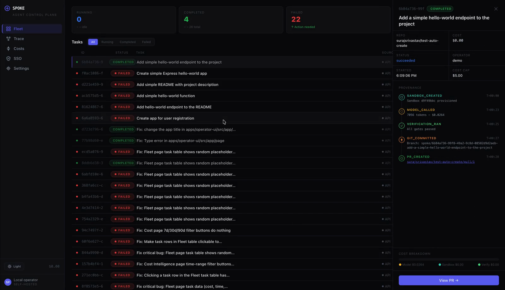
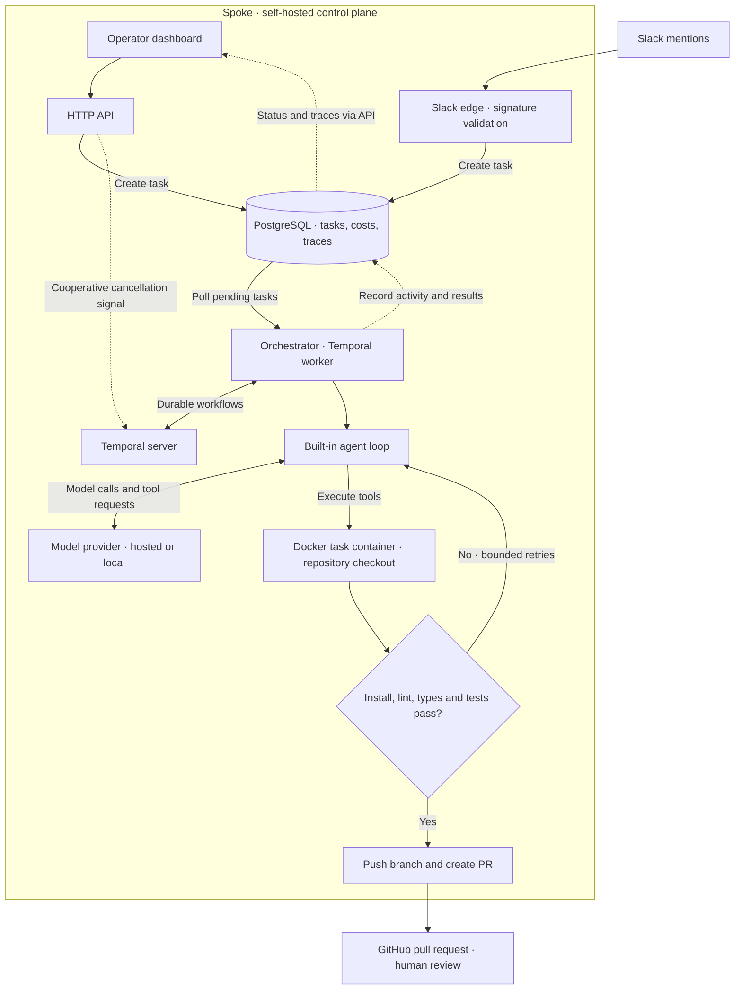

# Spoke

**An open-source control plane for coding agents.**

Submit a task, watch an agent work in a Docker container, inspect its trace,
and review the resulting pull request. Self-hosted, multi-model, MIT licensed.

**Status: experimental OSS beta for trusted, local use.** Spoke is not a
hardened multi-tenant service. Read the [deployment boundaries](SECURITY.md)
before connecting repositories or exposing any service.

[](https://github.com/surajsrivastav/spoke/blob/main/.github/assets/demo.mp4)

## What works today

- Submit tasks through the dashboard, HTTP API, or optional Slack integration.
- Run the built-in agent loop with Anthropic or OpenAI-compatible model providers,
  including OpenRouter and local Ollama.
- Execute tasks in Docker containers with Temporal workflow orchestration.
- Run dependency installation, lint, type checks, and tests before pushing a branch.
- Inspect recorded model/tool activity, costs, verification results, and PR links.
- Request cancellation from the dashboard or API. Cancellation is cooperative;
  an in-flight activity may finish before the workflow stops.

There is no standalone CLI. WhatsApp is an experimental echo/webhook scaffold;
it does not enqueue tasks and is disabled in the default setup. Model-provider
support is not an adapter for arbitrary third-party coding-agent runtimes.

## Quick start: local development

Use Docker with Compose, Node **22.23.2** (`nvm use`), and pnpm **10.33.0**.
The Docker daemon must be available to the local orchestrator.

```sh
git clone https://github.com/surajsrivastav/spoke.git
cd spoke
nvm use
npm install -g pnpm@10.33.0
pnpm install --frozen-lockfile
pnpm --filter @spoke/db generate
cp .env.example .env.local
```

Configure a model provider in `.env.local`. The default uses Ollama at
`http://localhost:11434/v1`; install/start Ollama and pull your selected model
(the example uses `llama3.2:3b`), or choose a hosted provider and supply its key.
Model tool-use quality varies; a small local model is useful for exploration
but does not guarantee successful coding tasks. Set `GH_TOKEN` to a token scoped
to a disposable repository you own if you want branch pushes and PR creation.

```sh
# Infrastructure only; application ports remain free for local development.
docker compose -f docker-compose.local.yml up -d --wait
pnpm migrate
pnpm dev
```

Open [localhost:3000](http://localhost:3000). `pnpm dev` starts the dashboard and
orchestrator and loads the root `.env.local`. PostgreSQL is on port 5432,
Temporal on 7233, and its inspector on 8233. The worker has no HTTP port.

In another terminal, enable Slack only after configuring its token and signing secret:

```sh
pnpm dev:slack
```

### Run the applications in Docker instead

Do not run `pnpm dev` alongside the containerized applications on the same ports.

```sh
docker compose -f docker-compose.local.yml --profile apps up -d --build
```

The orchestrator applies database migrations when it starts. Compose overrides
database and Temporal addresses with service hostnames and reaches host Ollama
through `host.docker.internal`. Ports are published on loopback only. The
orchestrator mounts the Docker socket; use a dedicated machine/VM for agent work.

### Submit and inspect a task

Use a disposable repository containing a pnpm-compatible `package.json` with
`lint`, `typecheck`, and `test` scripts. Missing or failing scripts block verification.
The current PR flow targets a `main` branch.

```sh
curl -X POST http://localhost:3000/api/tasks \
  -H 'Content-Type: application/json' \
  -d '{"goal":"Add a small README example","repo_url":"https://github.com/YOU/test-repo"}'

curl http://localhost:3000/api/tasks
curl -X POST http://localhost:3000/api/tasks/TASK_ID/kill
```

The worker polls pending tasks. The dashboard shows their status and traces.
These examples assume the local beta's default `AUTH_ENABLED=false`; do not
expose it to a network. Existing SSO/RBAC is incomplete and does not protect all
API routes (see [security policy](SECURITY.md)).

## Verify your installation

```sh
pnpm lint
pnpm typecheck
pnpm test
pnpm build
# Real disposable Docker sandbox: success and failure paths, no model/GitHub keys.
pnpm exec tsx scripts/sandbox-smoke.ts
```

CI runs the quality checks, sandbox smoke test, and application image builds.
The smoke test downloads a container image and installs tools, then removes its
own sandbox. It does not exercise a live model or create a PR. Follow the
[release checklist](docs/oss/RELEASE.md) for that separate acceptance check.

## Architecture



The worker owns the task lifecycle, including container provisioning and cleanup.
After verification retries are exhausted, the task fails without creating a PR.
Docker execution uses the host daemon; see [security boundaries](SECURITY.md).

Recorded provenance and traces flow back to PostgreSQL and the dashboard.
See [architecture details](docs/architecture/README.md); older phase/PRD documents
describe planned capabilities and are not the current support contract.

| Directory | Purpose |
|---|---|
| `apps/operator-ui` | Next.js dashboard and API |
| `apps/orchestrator` | Temporal worker and activities |
| `apps/slack-edge` | Signed Slack event receiver |
| `apps/whatsapp-edge` | Experimental webhook scaffold |
| `packages/agent` | Built-in model loop, Docker tools, verification, GitHub |
| `packages/db`, `packages/provenance`, `packages/shared` | Storage, event recording, common types |
| `infra/terraform` | Historical GCP infrastructure; not validated for this Docker beta |

## Contribute

See [CONTRIBUTING.md](CONTRIBUTING.md), [CODE_OF_CONDUCT.md](CODE_OF_CONDUCT.md),
and [SECURITY.md](SECURITY.md). Issues and focused pull requests are welcome.
There are no separate proprietary terms for this repository: [MIT License](LICENSE).
