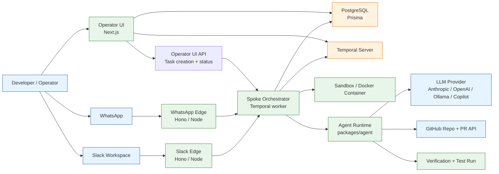
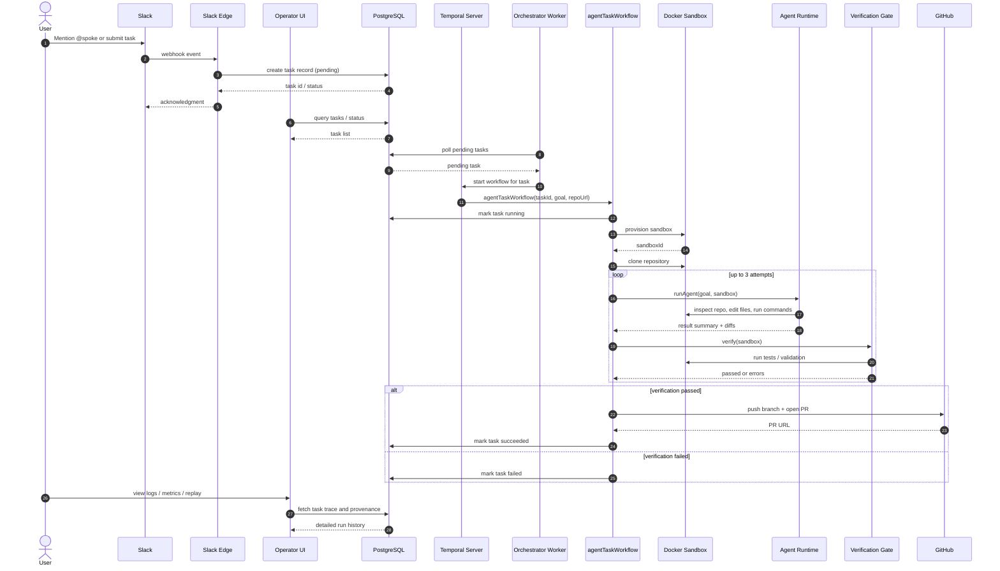
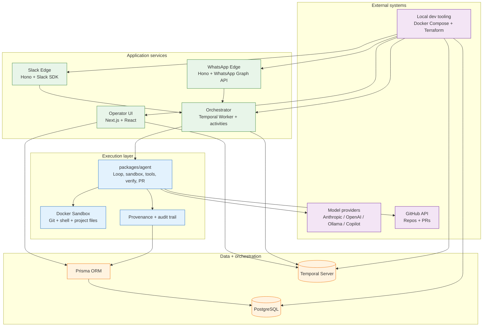

# Spoke Architecture

This document captures the runtime architecture of Spoke as implemented in the monorepo: task ingress from Slack and WhatsApp, control-plane orchestration through Temporal, isolated agent execution in sandboxes, verification, provenance, and GitHub PR creation.

## 1) Contextual diagram

### What this context shows

- Task intake comes from Slack, WhatsApp, and the Operator UI.
- The edge services do lightweight request validation and Then create or forward tasks.
- The orchestrator is the main control plane and uses Temporal to persist workflow state.
- Execution happens in a sandboxed environment, while the agent runtime interacts with model providers and GitHub.
- Postgres stores task metadata, run history, provenance, and status transitions.

---

## 2) End-to-end sequence diagram

### Important runtime behavior

- The workflow is resilient to failure and supports retries and verification loops.
- Kill switches are modeled as workflow signals, letting a task be cancelled while it is running.
- The orchestrator polls for pending tasks and starts Temporal workflows deterministically.

---

## 3) Tooling and platform stack

### Tooling inventory

- Runtime and framework tooling
  - TypeScript monorepo with pnpm workspaces
  - Next.js for the Operator UI
  - Hono for the edge HTTP services
  - Temporal for workflow orchestration and signals
  - Prisma + PostgreSQL for persistent state and provenance

- Execution tooling
  - Docker-based sandboxes for isolated tasks
  - Agent runtime in `packages/agent` for loops, verification, git operations, and PR creation
  - OpenRouter / Anthropic / OpenAI-compatible / Ollama / Copilot model routing

- Ops and deployment tooling
  - Docker Compose for local development
  - Terraform in `infra/terraform` for Cloud Run and managed infrastructure
  - Vitest and Stryker for testing and mutation coverage

---

## 4) Service map

| Component | Responsibility | Primary code path |
|---|---|---|
| `apps/slack-edge` | Receives Slack events, verifies requests, forwards tasks | `apps/slack-edge/src/index.ts` |
| `apps/whatsapp-edge` | Receives WhatsApp messages and creates tasks | `apps/whatsapp-edge/src/index.ts` |
| `apps/operator-ui` | Dashboard, task management, kill controls, status views | `apps/operator-ui/src/app` |
| `apps/orchestrator` | Temporal worker and workflow execution | `apps/orchestrator/src/index.ts` |
| `packages/agent` | Agent loop, tools, verification, git, PR logic | `packages/agent/src/*.ts` |
| `packages/db` | Prisma schema and task persistence | `packages/db/prisma/schema.prisma` |
| `packages/provenance` | Audit and provenance chain | `packages/provenance/src` |
| `packages/shared` | Environment config and shared types | `packages/shared/src` |

## 5) Design tradeoffs

### Why Temporal?

Temporal is the right fit because Spoke is not a single synchronous LLM call; it is a long-running, stateful workflow with retries, compensation, observability, and operator intervention.

Temporal gives us:

- Durable workflow state across retries and restarts
- Signals for kill switches and cancellation without rewriting task state machines
- Built-in retries, timeouts, and activity boundaries
- A clean separation between orchestration logic and execution logic
- Better operational visibility than ad hoc polling loops in app code

In practice, this matters because an autonomous coding task can span minutes or hours, cross multiple model attempts, interact with a sandbox, and require failure recovery. A bare chain or process-local loop would not give the same guarantees.

### Why not just an IDE-like workflow UI / no orchestration layer?

A visual workflow tool or IDE-like orchestration surface is useful for prototyping, but it is not enough as the runtime backbone for production autonomous work.

Reasons not to choose that model:

- The system must survive process restarts and infrastructure failures.
- Task execution needs durable checkpointing and reliable re-entry.
- Operators need to kill, inspect, replay, and audit work after the fact.
- The workflow spans multiple services and external systems: Slack, WhatsApp, sandbox, model provider, GitHub, and database.

A workflow IDE can help model the process, but production-grade execution still needs a durable workflow runtime.

### Why not LangGraph or a simple chain runner?

LangGraph and chain-based orchestration are strong for agentic reasoning and prompt-driven graphs, but they solve a different problem than Spoke’s operating model.

Tradeoff summary:

- LangGraph / chains: great for reasoning graphs, agent loops, tool calling, and prompt composition
- Spoke: great for durable operational workflows with human control, retries, kill switches, and auditability

Why a plain chain is not enough here:

- No first-class durable execution across crashes and restarts
- Weak operator control and task lifecycle management
- Harder to handle long-lived external tasks with verification gates and sandbox cleanup
- Less natural fit for signal-driven cancellation and replay

Why Spoke does not center on LangGraph alone:

- This is operational infrastructure, not just a reasoning graph
- The real complexity is scheduling, state transitions, sandbox management, and GitHub verification
- We still use agentic execution patterns internally, but the runtime substrate is orchestration-first rather than graph-first

### Decision in one line

Spoke chooses Temporal as the durable execution engine and keeps the agent loop inside activities/workflows, because the product requirement is reliable autonomous task execution under operational control—not just a smart chain of LLM calls.

---

## 6) Roles and responsibilities

Access control is enforced by `apps/operator-ui/src/lib/rbac.ts` and `apps/operator-ui/src/lib/auth.ts`, and is gated behind the `AUTH_ENABLED` flag (unset by default in OSS, so single-operator deployments are unauthenticated).

| Role | Responsibilities | Permitted actions |
|---|---|---|
| `viewer` | Read-only observer: monitors task status and history without the ability to change anything. | `view_tasks` |
| `operator` | Day-to-day driver of the system: submits tasks and can halt runaway or incorrect work within their own team. | `view_tasks`, `create_task`, `kill_task` |
| `admin` | Full administrative control: everything an operator can do, plus user and settings management, and cross-team reach. | `view_tasks`, `create_task`, `kill_task`, `manage_users`, `manage_settings` |

Enforcement details, from `rbac.ts` and the `F-08` RBAC test spec (`apps/operator-ui/src/__tests__/F08-rbac.feature.test.ts`):

- **Least privilege by default** — `can(role, action)` checks a role's action list and denies anything not explicitly granted; unknown roles are denied everything.
- **Team scoping** — an `operator` may only act on tasks belonging to their own `team_id`; a cross-team task lookup returns `404` rather than `403`, so operators can't even confirm a task exists in another team.
- **Admin bypasses team scoping** — `admin` has `team_id: null` and can view or kill tasks across every team.
- **Every permission check is audited** — both allowed and denied actions write an `auditLog` entry (`actor`, `action`, `resource`, `allowed`), e.g. `KILL_TASK` vs. `KILL_TASK_DENIED`.
- **Role changes invalidate live sessions** — a session is minted with the role at login time; if the underlying user's role is changed afterward (e.g. an admin demotes an operator to viewer), the next request compares the two, deletes the stale session, and forces re-authentication (`session_expired`) instead of trusting the cached role.
- **SSO assigns a default role** — new users provisioned via SSO (`apps/operator-ui/src/app/sso`) receive `SSO_DEFAULT_ROLE` (defaults to `operator`); promotion to `admin` is a separate, explicit action via `manage_users`.

---

## 7) Architectural summary

Spoke is an operator-first orchestration platform: request sources feed task records into a durable workflow system, the orchestrator provisions isolated execution environments, and the agent loop performs repository work under verification before publishing a branch and opening a PR. The design intentionally separates ingress, orchestration, execution, and persistence so tasks can be tracked, retried, and killed without losing operational control.
